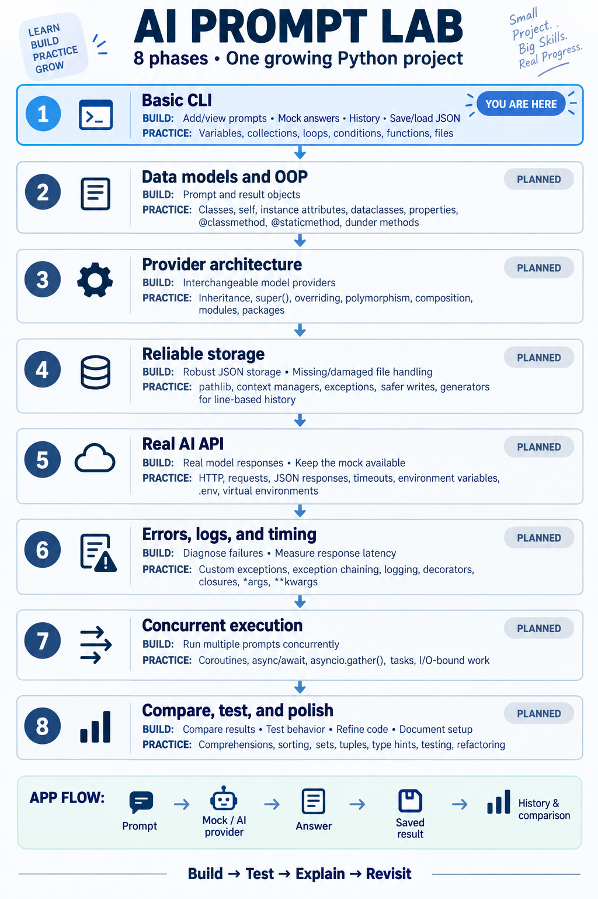

# AI Prompt Lab



A practical Python revision project for an AI Engineering roadmap. Build it in small steps: write code, run it, review mistakes, and then add the next feature.

## What we are building

A command-line application that lets you add prompts, run them through a model, save answers, and compare results.

```text
Start application
       |
Load saved prompts and results (once persistence exists)
       |
Show menu <-------------------------------------------+
       |                                              |
       +--> Add prompt --> Validate --> Store         |
       +--> View prompts                              |
       +--> Run prompt                                |
       |       |                                      |
       |       +--> Select prompt and model           |
       |       +--> Generate answer                   |
       |       +--> Record answer, time, and status   |
       |       +--> Save result                       |
       +--> View history / compare results            |
       +--> Exit                                      |
       |                                              |
       +---------- Return after each action ----------+
```

A prompt is an instruction such as "Explain Python generators." A result records what a model returned for that prompt. Initially the model is a mock: it produces a predictable fake answer without network access or an API key.

## Current progress

The current `main.py` has a repeating menu, adds nonempty prompt strings to a list, displays them, and exits. Data exists only in memory and disappears when the program closes.

The next step is to store each prompt as a dictionary with an ID and text, then update the display loop:

```python
{"id": 1, "text": "Explain Python lists"}
```

Do not create the final architecture yet. Start with `main.py` and introduce files when a feature needs them.

## Phase 1: Build the basic CLI

Build in this order:

1. Add and view prompts through a repeating menu. (Implemented.)
2. Give prompts IDs using dictionaries.
3. Extract small functions for adding, finding, and displaying prompts.
4. Select a prompt by ID and generate a mock answer.
5. Keep a history of results.
6. Save and load prompts and results using JSON.

| Concepts | Where and why we use them |
| --- | --- |
| Variables, object references, dynamic typing | Names such as `prompt_text` refer to objects. `input()` returns a string; converting an ID creates an integer. Dynamic typing does not mean we should reuse names for unrelated types. |
| Lists, dictionaries, nested collections | A list holds prompts; each dictionary holds an ID and text. A separate list holds result dictionaries. |
| Strings, mutability, immutability | `.strip()` returns a cleaned string. `.append()` changes an existing list. |
| Assignment and aliasing | Appending a dictionary stores a reference to it. Changing that dictionary later also changes what the list displays. |
| `==` versus `is` | Use `==` for menu values and IDs. Use `is None` when a lookup returns no prompt. |
| Loops, conditions, truthiness, `break` | Repeat the menu, reject empty strings, display collections, and exit. |
| Parameters, arguments, `return` versus `print` | A lookup function receives an ID and returns a prompt. The CLI decides how to display it. |
| Positional and keyword arguments, defaults | Give the mock function simple options with sensible defaults. Avoid mutable defaults such as an empty list. |
| LEGB scope | Keep function variables local and pass data explicitly. Understand why a function can mutate a passed list but rebinding its parameter does not replace the caller's variable. |
| Basic type hints | Annotate small functions as they appear, rather than waiting until the final refactor. |
| Basic exceptions | Handle invalid numeric IDs and expected file/JSON errors near the relevant operation. |
| `with open()`, UTF-8, `pathlib` | Read and write data files with predictable paths and automatic file closing. |
| JSON | `json.dump()` writes objects to a file; `json.load()` reads them back. `dumps()` and `loads()` work with strings. |

Checkpoint: Add two prompts, run one through the mock, close the app, reopen it, and recover the saved prompts and history.

## Phase 2: Introduce data models and OOP

As dictionary keys become repetitive, introduce `Prompt` and `RunResult` objects. First understand a small ordinary class, then consider a dataclass for these data-focused objects.

| Concepts | Where and why we use them |
| --- | --- |
| Classes, objects, `__init__`, `self` | Each `Prompt` instance represents one saved instruction. The constructor establishes its initial state. |
| Instance versus class attributes | Prompt text belongs to an instance. A shared constant can belong to the class; mutable prompt collections should not accidentally be shared as class attributes. |
| Instance methods and encapsulation | Put behavior with the data it operates on, such as validating a prompt update. |
| Public names, `_internal`, `__name` | Use public methods for supported operations and an underscore for internal details. Name mangling prevents some accidental subclass collisions; it is not security. |
| `@classmethod` | `Prompt.from_dict(data)` reconstructs a prompt loaded from JSON. Python supplies the class as `cls`; `data` is your argument. |
| `@staticmethod` | If a validation helper belongs naturally with `Prompt`, it may receive text without needing an instance or class. Compare this with a plain module function before choosing. |
| `@property` | Expose a useful computed value such as `prompt.word_count` without storing a duplicate count. Python supplies that prompt object as `self`. |
| Property setters | Practice validated text assignment if the model supports editing. Do not add a setter to a read-only computed property. |
| `__repr__` | Make objects understandable during debugging. |
| Dataclasses | Generate repetitive initialization and representation methods for data models. Type hints alone do not validate runtime values. |
| Shallow versus deep copy | Compare an editable prompt variant with a historical snapshot. A shallow copy still shares nested mutable values such as tag lists. |

Object mapping example: in `prompt = Prompt(id=1, text="Explain lists")`, `Prompt` is the class and `prompt` refers to the new instance. Inside its instance methods, `self` refers to that instance.

Checkpoint: The same CLI behavior works using objects, and saved JSON can be converted to and from those objects.

## Phase 3: Introduce providers and composition

Move mock generation into a `MockProvider`. Introduce a small provider contract when preparing a second implementation, and give a runner a provider to use.

```text
CLI --> Runner --> Provider
          |          +--> MockProvider
          |          +--> Real API provider (Phase 5)
          +--> Result
```

| Concepts | Where and why we use them |
| --- | --- |
| Composition | A runner HAS a provider: it stores a provider object and calls it. This lets us replace the model without rewriting execution logic. |
| Inheritance, overriding, polymorphism | Providers share a contract such as `generate()`, while each implements generation differently. The runner uses the common operation. |
| `super()` | Use it only if a subclass needs initialization or behavior from a base class. An empty base class does not justify a meaningless call. |
| `__len__` | If a prompt collection class becomes useful, `len(manager)` can report its number of prompts. |
| `__call__` | Optional focused exercise: make an evaluator callable as `evaluator(result)`. Keep an ordinary method if it is clearer. |
| Modules, packages, imports, `__init__.py` | Separate models, execution, and providers when they become distinct responsibilities. Practice absolute and relative imports within the package. |

Exact composition mapping:

```python
provider = MockProvider()
runner = Runner(provider=provider)
```

In `Runner.__init__(self, provider)`, `self` is the new runner, and the `provider` parameter refers to the existing mock object. `self.provider = provider` stores that reference; it does not create another provider. The runner IS NOT a provider; it uses one.

Checkpoint: Swap between two mock provider implementations without changing the runner's execution logic.

## Phase 4: Improve storage

Strengthen the simple JSON persistence introduced in Phase 1.

| Concepts | Where and why we use them |
| --- | --- |
| `pathlib`, relative versus absolute paths | Resolve the data directory consistently even when the program is launched from another working directory. |
| File modes `r`, `w`, `a` | Read JSON with `r` and replace a full JSON document with `w`. Use append mode for formats designed for it, such as JSON Lines; appending JSON arrays creates invalid JSON. |
| `read`, `readline`, `readlines` | Compare whole-file reading with line-based reading in a small exercise. Use JSON loaders for regular JSON documents. |
| Context managers and UTF-8 | Close files reliably and preserve prompt text across languages. |
| Exceptions, `else`, `finally` | Distinguish missing files from malformed JSON. Use `else` for work after a successful operation and `finally` only for cleanup that is actually needed. `with` already closes files. |
| Safer writes | Write a temporary file and replace the destination to reduce the risk of leaving a partially written JSON document. |
| Generators, `yield`, `next`, `StopIteration` | If history grows, iterate over JSON Lines results lazily. Learn that ordinary `json.load()` still loads the whole document. |

Checkpoint: Missing files have a sensible first-run behavior, malformed data produces a clear error, and failures do not silently overwrite existing history.

## Phase 5: Connect a real AI API

Add one real provider while retaining the mock for offline development. Choose the provider and check its official API documentation at this phase.

| Concepts | Where and why we use them |
| --- | --- |
| Virtual environments, interpreter selection, pip | Isolate dependencies and ensure the terminal and IDE use the intended interpreter. |
| `requirements.txt` | Record the dependencies needed to run the app. |
| Environment variables, `.env`, `python-dotenv`, `os.getenv()` | Load configuration and API credentials outside source code. Keep real secrets out of Git; put placeholder names in `.env.example`. |
| Client/server, HTTP, `requests` | The provider acts as a client calling a remote model service. |
| POST, headers, request bodies | Send generation requests with the provider's documented payload and authentication scheme. Bearer authentication is one possible scheme, not a universal requirement. |
| GET and query parameters | Use a model-listing endpoint if the selected service offers one. |
| Status codes, timeout, `raise_for_status()` | Detect HTTP failures and avoid waiting indefinitely. |
| `response.json()` | Decode a response body into Python data, then validate the fields the app needs. |
| PUT, PATCH, DELETE | Review their meanings in a separate HTTP exercise if the provider has no relevant endpoints. Do not invent unnecessary project features to use every verb. |
| Type aliases, `str | None`, `Any` | Describe shared structures and optional config values. Restrict `Any` to boundaries where data is genuinely unknown, then validate it. |

Checkpoint: Run the same saved prompt with the mock and a real model, and save both results in a consistent format.

## Phase 6: Improve failures, logging, and timing

Basic validation already exists. Now give failures consistent meanings and make runs observable.

| Concepts | Where and why we use them |
| --- | --- |
| Custom exceptions and `raise` | Represent useful failures such as provider errors or invalid stored data. |
| Exception chaining | Translate an underlying failure using `raise ProviderError(...) from e` while preserving its cause. |
| `try` / `except`, `except Exception as e` | Catch expected errors specifically. Reserve broad catches for an appropriate outer boundary; never silently discard failures. |
| `logging.getLogger(__name__)`, `basicConfig` | Give modules named loggers and configure handlers once at application startup. |
| Log levels, timestamps, file logs | Use DEBUG for diagnostics, INFO for normal events, WARNING for recoverable issues, ERROR for failed operations, and CRITICAL for application-wide failures. Avoid logging API keys. |
| `print` versus logging | Print user-facing menu/output; log operational events for diagnosis. |
| Timing | Measure elapsed generation time with a monotonic performance clock. |
| Decorators, wrappers, `functools.wraps` | Reuse timing behavior around functions while preserving function metadata. |
| `*args`, `**kwargs`, unpacking | Forward a wrapped function's positional and keyword arguments without hard-coding its signature. |
| Functions as objects, higher-order functions | Pass a function to a decorator or an evaluator to an execution helper. |
| Nested functions and closures | A timing wrapper remembers the function it wraps. |
| Callbacks | Optionally call a supplied progress function after each completed run. |
| `nonlocal` and `global` | A small closure exercise can count completed runs with `nonlocal`. Explain `global`, but prefer explicit state over introducing global mutable application data. |

Checkpoint: A failed run gives a useful message, preserves diagnostic context, and does not prevent the next menu action. Successful runs record latency.

## Phase 7: Run prompts concurrently

First simulate delayed model responses with an async mock, then introduce an async HTTP client for the real provider.

| Concepts | Where and why we use them |
| --- | --- |
| `async def`, coroutines, `await` | Represent operations that can pause while waiting for model responses. |
| `asyncio.run()` | Start the async workflow from the synchronous entry point. |
| `asyncio.gather()` | Run several independent prompt requests concurrently and collect results. |
| `asyncio.create_task()` | Schedule a coroutine when we need to manage its execution separately. |
| Sequential versus concurrent execution | Compare elapsed time for several simulated requests. |
| `time.sleep()` versus `await asyncio.sleep()` | Blocking sleep stops progress on the event-loop thread; async sleep lets other tasks run. |
| I/O-bound versus CPU-bound work | API waits suit async concurrency. Async alone does not make CPU-heavy work faster. |
| Shared mutable state | Keep result collection and persistence coordinated so concurrent tasks do not overwrite each other's files. |
| Async decorators | Await the wrapped coroutine when timing async functions; a synchronous wrapper would only time coroutine creation. |

Do not call blocking `requests` directly inside async tasks. Use an async HTTP client, and introduce concurrency limits when needed for service limits.

Checkpoint: A batch completes concurrently, associates every answer with the correct prompt, and reports individual failures clearly.

## Phase 8: Compare, test, refactor, and polish

| Concepts | Where and why we use them |
| --- | --- |
| Tuples and hashability | Use an immutable `(prompt_id, model_name)` pair as a grouping key when useful. Lists and dictionaries cannot be dictionary keys. |
| Sets | Collect unique model names or tags. |
| Comprehensions | Filter successful runs and build compact summaries. |
| Lambda and functions as objects | Sort results with a key function, such as latency. Use a named function when the logic becomes complex. |
| Generator expressions and lazy evaluation | Calculate summaries over iterables without unnecessary intermediate lists. |
| Type hints such as `list[str]`, `dict[str, float]` | Clarify collections of names and numeric summaries; review annotations as the design settles. |
| Tests | Verify blank-input rejection, ID lookup, storage round trips, mock behavior, and failure handling. Use the mock so tests need no paid API calls. |
| Refactoring and documentation | Separate responsibilities, remove duplication, document setup, and preserve existing behavior. |
| Optional export | Export comparison results only after the core workflow is reliable. |

Compare latency, output, and explicit evaluation criteria. A faster or longer response is not automatically a better answer.

Checkpoint: Another learner can follow the setup instructions, run the mock workflow, execute tests, and understand the project structure.

## Possible final structure

This is a destination, not a list of files to create now. Names can change as the project develops.

```text
main.py                 CLI and application entry point
README.md               Setup, workflow, and learning roadmap
requirements.txt        Dependencies
.env.example            Configuration names with placeholders
.gitignore              Exclude secrets and local environment files
src/
    __init__.py
    models.py           Prompt and RunResult data models
    config.py           Configuration loading and validation
    prompt_manager.py   Prompt collection operations
    runner.py           Coordinate model calls and results
    storage.py          Load/save data
    decorators.py       Reusable timing wrappers
    exceptions.py       Application-specific exceptions
    providers/
        __init__.py
        base.py         Common provider contract
        mock.py         Offline predictable responses
        real_api.py     Selected real provider
data/
    prompts.json
    results.json
logs/
    app.log
tests/
```

## How we will work

For each small feature:

1. State what we are building and which concepts it revises.
2. Explain why those concepts fit this feature.
3. You write as much code as possible.
4. Review the saved code and explain mistakes precisely.
5. Run a few meaningful checks before moving on.

When composition, class methods, static methods, properties, dunder methods, or dataclasses appear, explicitly identify the objects involved and how arguments map to parameters.

The aim is to understand and apply Python, not to force every language feature into the application. Concepts without a natural role get a focused exercise instead of unnecessary architecture.
